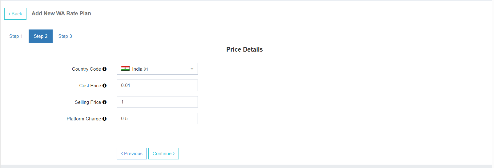

# WhatsApp Admin Panel 

## 1. Active Service Description

**WhatsApp**: By enabling this plugin, the user will be able to access and send out messages via WhatsApp and configure chatbots for automated responses for their businesses.

---

## 2. Credits

- The user will have a **separate wallet balance for WhatsApp**.
- The admin can view the **credit balance for SMS messaging and WhatsApp separately**.
#### To add credits to the user's balance:
  1. Click on **Add New**.
  2. Select **WhatsApp**.
  3. Enter a **payment reference**.
  4. Enter the **amount**.
  5. Click on **Add Credits** to top-up the user’s balance.

## Example Screenshot

---

## 3. User Rate Plan

In the **WhatsApp** section, you can assign a **rate plan** that needs to be applied to the user.  
Select the rate plan from the dropdown menu. All the rate plans configured in the **Billing** section will be available for selection based on your requirements.

### WhatsApp Rate Plans

Similar to MT message rate plans, the admin must define specific **WhatsApp rate plans** to manage billing. In the **Actions** section, the admin can:

1. **Edit** – Click the **Edit** button to rename or enable/disable a rate plan.  
2. **View** – Click the **View** button to view and modify all prices in the selected rate plan.  
   - Any changes made will apply to all users assigned to that plan.
3. **Copy** – Click the **Copy** button to duplicate the plan under a new name.  
4. **Delete** – Click **Delete** to permanently remove a rate plan.  
   > ⚠️ This action **cannot be undone** — you will need to recreate the plan from scratch.

## Example Screenshot

---

## 4. Creating a New Rate Plan

Click on **Add New Rate Plan** to create a new rate plan for your users.

---

### Step 1: Enter Basic Details

- Enter a **friendly rate plan name**.
- Choose whether to keep the rate plan **active** or **inactive**.
- Click **Continue** to move to the next step.

---

### Step 2: Define Pricing

Here you can configure how to bill your users for WhatsApp messaging.

- **Country Code**: Select the country for which the rate plan applies.
- **Cost Price**: The cost you’re charged by **META** per message.
- **Selling Price**: The price you charge your users per message.
- **Platform Charge**: Optional fee for using your platform to send messages.

---

#### 💡 Use Case Scenarios

**Case 1: Admin pays META, no platform fee**

- Only **Cost Price** and **Selling Price** are defined.
- **Platform Charge** is left blank or null.
- User credits are deducted based on the **Selling Price**.

**Case 2: User pays META, platform fee applied**

- **Selling Price** is left blank or null.
- **Platform Charge** is configured.
- User pays META directly; admin only earns via platform fee.

**Case 3: Admin charges both selling price and platform fee**

- **Cost Price**, **Selling Price**, and **Platform Fee** are all configured.
- User credits are deducted based on:  
  `Selling Price + Platform Fee`.

---

### Step 3: Review and Save

- Review the **rate plan summary** shown.
- Ensure all values are configured correctly.
- Click **Save** to finish creating the rate plan.
